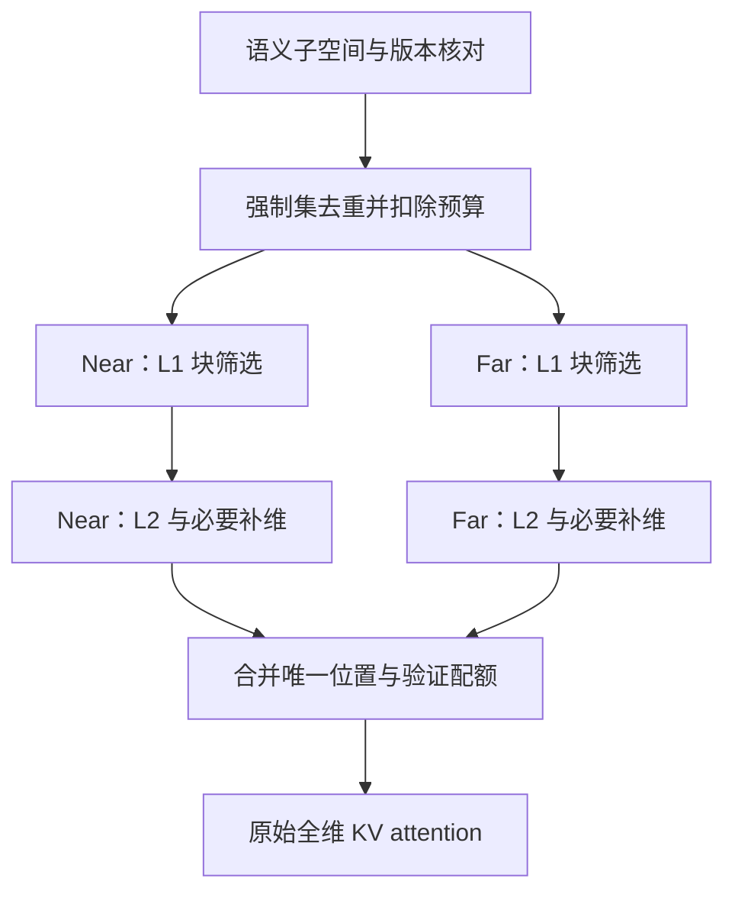

# 子空间设计改进建议：从固定选维到可核验的预算化检索

版本：v1.1（2026-10-07增补FC低秩融合与选择质量分析）。日期与文献检索日期：2026-10-07。对象：PSI / indexer 的子空间设计。依据：2026-10-06 的 `PSI_DAC2027_English_Revision.pdf`、同日泛化审阅方案与子空间审稿意见，以及下列原始研究。9 月旧稿只用于辨认历史方案，不作为当前方法定义。


**v1.1阅读入口：第18节给出关键FC＋正交补低秩、块锚点和有限距离代表频率融合；第19节给出CA与输出/e2e质量的区别、精确反例，以及SAS/OVAL近邻和匹配成本的验证链。当前推荐先比较F0/F1，不直接改生产。**

**建议保留“先定义子空间，再划分 near/far，两端都执行 L1 粗筛和 L2 细筛”的骨架，将子空间模块升级为三类位置编码都可使用的接口。首选低成本的结构化选维与完整旋转对，按查询残差判断何时补维；NoPE 的查询加权投影作为第二候选。严格证书用于校验与诊断，只有实际能减少读取时才考虑生产采用。**

目前不能承诺新方案优于原 PSI。数学推导和有限正确性检查已经完成；模型质量、GPU 延迟、真实 token/KV 流量和匹配预算的端到端收益尚未测量。本文给出可执行的设计和判别实验，不把待测设计写成性能提升。

## 1. 当前稿已经解决了什么，仍缺什么

### 1.1 当前方法的准确基线

| 项目 | 最新稿实际定义 | 分析时必须保持的边界 |
|---|---|---|
| Qwen3 128 维头 | rotate_half 配对 `(j,j+64)`；32 维为 `{48,…,63} ∪ {112,…,127}` | 两半都参与 RoPE，后一半不是 NoPE |
| 主质量配置 | L1 使用 full128；L2 使用量化低频32 | 不能用低维 L1 的成本解释主配置质量 |
| L2 存储 | 16 级编码，每坐标占1字节；32编码+两个float32参数=40 B/token/KV-head | 不是 packed INT4，更不是原始 KV 压成40 B |
| 最终 attention | 仅在选出的原始、全维 KV 上计算 | 不会恢复被 L1/L2 漏掉的 token |
| near/far | 两个候选域及独立配额，强制集另算 | 属于防止预算挤占的策略，不能保证全局最优支持集 |
| 原型与质量 harness | 原型有全局 L1、跨头 union 后再分区等差异 | 当前原型不能直接继承区域化质量契约 |

最新稿明确撤回了“低维上界保证全维无漏选”等旧表述；本文不把已经修正的问题当作仍在发生的错误。

### 1.2 已有结果给出的设计约束

稿中八样本回放的完整低频对 far attention-mass recall 为0.811，而每层静态校准对为0.849、逐查询选对为0.865；但静态校准变体端到端分数50.04，低于其匹配参考50.54。因此，**回放表示更好不等于生成质量更好**；query drift、校准目标、实现差异都需要区分，不能只选择一个解释。

主 LongBench 均分50.78，相对 FullKV 50.36 的配对差值区间为[-0.18,1.02]。这是稿中归档结果，本轮没有复现，也不证明等效。当前完整请求记录仍慢于 Quest；TP2、batch16 的预填充为 PSI 136.03 s、Quest 54.43 s，输入以260,000字符截断，真实 token 数未记录。应先解决一次构建/增量更新与测量契约，再判断子空间改进能否改变端到端成本。

## 2. 统一对象：究竟逼近哪个分数

本文使用列向量。键序列记为行矩阵 `K` 时，分数为 `Kq`；不要与知识卡采用“每列一个键”的记法混淆。

### 2.1 普通 attention 的原始目标

令未施加位置变换的向量为 `q,k_j`，实际位置变换为 `T(t),T(j)`，定义

\[
\widetilde q=T(t)q,\qquad \widetilde k_j=T(j)k_j,\qquad
s_j=\tau\widetilde q^T\widetilde k_j+b_j.
\tag{1}
\]

`τ` 是**原模型实际 attention scale**；不因 index 从128维变成32维而改为 `1/√32`。`b_j` 包括实际位置偏置；因果、padding、滑窗有效域另由 mask 处理。NoPE 为 `T=I`；标准 RoPE 为正交旋转。ALiBi 等情形即使没有旋转，也不能漏掉 `b_j`。

对标准部分 RoPE，可写

\[
T(p)=I_{d_N}\oplus R_1(p)\oplus\cdots\oplus R_m(p),\quad
s_j=\tau\left[q_N^Tk_{N,j}+q_R^TR(t)^TR(j)k_{R,j}\right]+b_j.
\tag{2}
\]

这里的 NoPE 是实际不旋转的内容分量，不是某个数组尾部的昵称。对动态缩放、YaRN、LongRoPE 或带幅值缩放的实现，读取实际相位和幅值函数；仅凭 `rope_theta` 不足以重建公式。下面涉及正交性的推导，必须对实际变换逐项核对；在施加变换后的向量上直接算范数的通用误差界仍可使用。

### 2.2 MLA 应在吸收后的真实缓存坐标中设计

若 `k_N,h,j=W_K,h c_j`，则

\[
s_{h,j}=\tau\left[\underbrace{(W_{K,h}^Tq_{N,h})^Tc_j}_{\bar q_h^Tc_j}
+\widetilde q_{R,h}^T\widetilde k_{R,j}\right]+b_{h,j}.
\tag{3}
\]

`c_j` 是共享 latent cache，`q̄_h` 是吸收后的 query。内容索引应优先存储 `A c_j`，并给每个头产生匹配的 query，避免为每头重建整段高维 NoPE keys。选32个原始 NoPE 坐标，未必使 latent 上的矩阵乘法降成32维；必须写出消费者的实际代数式和字节数。

MLA 的内容 latent 还参与 value 聚合。本文的**额外检索索引**可以变化而保留原始缓存；若改动原始 latent 的存储坐标或量化，就必须同时补偿 key 和 value 消费者。这是另一项更大范围的优化，不能混进本轮 selector 结论。

### 2.3 原生 DSA 是另一个目标

官方 DeepSeek-V3.2 indexer 使用自己的 learned query/key，经过 RoPE、归一化 Hadamard、FP8 与 scale 后，以形如

\[
I_j=\sum_h w_h\operatorname{ReLU}(a_{h,j})
\tag{4}
\]

的分数排序。它不是式(2)的原始 MLA 分数。官方 `weights_proj` 没有把权重强制为非负，必须处理有符号 `w_h`。Hadamard 后的物理坐标也混合了语义 NoPE/RoPE 通道。

因此两种实验应分开：

1. **逼近原生 indexer**：以原生解码 FP8 后的实际 `I_j` 为参照，保留 learned 表示、权重、scale、mask；压缩误差另计。
2. **用 PSI 替换 indexer**：以主 MLA 的内容/旋转分数产生新的支持集，再送入同一最终 MLA。它回答“冻结已适应 DSA 的模型后能否直接替换”，不证明两种系统在相同训练条件下的优劣。

对归一化正交 Hadamard `H`，全精度点积不变；语义投影 `P` 在变换后须变为 `HPH^T`。直接在 Hadamard 后取尾维不是同一子空间。FP8 量化破坏这个精确等价，必须额外界定误差。本轮核对的官方代码固定于 commit `a7e62ac04ecb2c0a54d736dc46601c5606cf10a6`。[R8]

## 3. 子空间与 RoPE：相容性和信息质量是两个命题

### 3.1 通用、可核对的残差恒等式

令 `U∈R^{d×r}`、`U^TU=I`、`P=UU^T`。索引

\[
u=U^T\widetilde q,\quad z_j=U^T\widetilde k_j,\quad
\widehat s_j=\tau u^Tz_j+b_j.
\]

因为投影正交，交叉项消失：

\[
s_j-\widehat s_j=\tau q_\perp^Tk_{\perp,j},\qquad
|s_j-\widehat s_j|\le |\tau|\|q_\perp\|_2\|k_{\perp,j}\|_2,
\tag{5}
\]

其中 `q⊥=(I−P)q̃`、`k⊥=(I−P)k̃`。这是经典投影与 Cauchy–Schwarz 的直接应用，不是新的研究定理。

**任意 post-RoPE 的正交投影都是合法近似。** 跨频率 PCA/SVD 并非数学错误；问题是能否离线编码、压缩后低成本旋转、动态更新，以及其 task quality。不能用“不与 RoPE 对易”否定它作为 post-RoPE 检索代理的合法性。

### 3.2 哪些子空间允许先压缩、再在低维中旋转

若要求低维空间存在正交 `R_r(p)`，使

\[
R(p)U=UR_r(p),
\tag{6}
\]

则 `range(U)` 对旋转族不变，正交补也不变，等价于 `PR(p)=R(p)P`。这保证保留空间内部可以闭合地进行位置变换；式(5)的两种残差范数在旋转前后相同。

**标准固定频率情形下的分类。** 假设位置为整数，所有非零频率位于 `(0,π)`，且彼此在模 `2π` 的正负意义下不同。对全部位置都对易的实正交投影，必须在每个旋转二维平面上取 `0` 或 `I₂`；NoPE 的零频子空间可选择任意正交子空间。

证明要点：`R(1)` 在复数域有成对特征值 `e^{±iω_g}`。不同频率对应不同特征空间；对易算子不能在不同特征空间间混合。单个二维平面中，对易矩阵形如 `aI+bJ`；实对称投影要求 `b=0`，再由 `P²=P` 得到 `a=0或1`。共轭配对还原到实域得到完整二维平面。

限制：相同频率的多个副本允许更丰富的混合；频率0或π、整数位置 alias、动态相位、特殊缩放都要单独处理。只在一个位置或一批位置上近似对易，不证明对全位置成立。单个平面内部换相位基允许，但在两个坐标都保留时不会产生新的信息选择。

**结论只涉及计算相容性，不涉及重要性排序。** 保留完整对并不能推出保留低频；保留低频也不能推出全维 top-k 一致。

### 3.3 低频稳定的准确含义与反例

对单个二维旋转，

\[
\|R(\omega\Delta)-I\|_2=2|\sin(\omega\Delta/2)|
\le\min(2,|\omega\Delta|).
\tag{7}
\]

这是“相位变化小”的条件；当 `|ωΔ|` 不小，低频仍可大幅旋转。本轮 `ω=.01, Δ=300` 的范数接近2，足以反驳“低频在 far 区始终近似不旋转”。重要性还依赖 query/key 幅度、各对贡献之间的抵消及目标排名间隔。

可构造只有高频对有非零 Q/K 幅值的例子，低频索引完全失去信息；也可以构造 NoPE 内容贡献占主导的混合模型。这样的反例不否定 Qwen3 的经验结果，只否定无条件推广。

## 4. NoPE-only：从廉价坐标到查询加权子空间

### 4.1 N0：最先实现和测量的坐标索引

选择 `r` 个实际 NoPE 坐标。候选规则包括：固定校准选维、SparQ 风格的查询幅值选维，以及按查询幅值乘键统计尺度选维。保留原 scale，不另行对 proxy softmax 温度做未经说明的重标定。

固定坐标索引易于连续存储、增量更新和块极值维护，适合第一版。查询自适应选维已有 SparQ 先例，不是新贡献；它需要读取相应坐标的 cache，数据布局不合适时，scatter/gather 与元数据成本可能抵消算术收益。对 GQA/MLA，共享字典或坐标集合的实际消费者是一个 KV 共享组，而不是任意独立 query head。

逐查询重要性可以用 `|q_i|·σ_{k,i}` 或 `q_i² E[k_i²]` 作为启发式；若使用逐维上界 `M_i≥max_j|k_{j,i}|`，则被舍弃坐标的全局误差上界为 `Σ_{i∉D}|q_i|M_i`。统计均方量不是严格最大值，必须标为经验评分，不得充当证书。

### 4.2 N1：为什么只对 K 做 PCA/SVD 不够

令 `M_q=E[qq^T]`、`M_k=E[kk^T]` 为**未中心化二阶矩**。若 q 与 k 独立，对正交 `P` 有

\[
E\left[(q^T(I-P)k)^2\right]
=\operatorname{tr}((I-P)M_k(I-P)M_q).
\tag{8}
\]

独立性使四阶联合矩可分解；普通 attention 的配对 Q/K 常不独立，不能默认使用这个公式。实际校准可直接最小化抽样的配对 score error，或优先测 near-top-k 比较与输出误差；不要为公式方便把相关样本当成独立抽样。

反例：`M_q=diag(.001,100)`，`M_k=diag(100,.01)`。K 方差最大的第一个维度对应 score 方差0.1，第二维对应1.0。保留 K 主方向不是此 score 目标的最优单维选择。当前未中心化 K-SVD 可作为重构基线，不能无条件称为中心化 PCA，更不能据此声称 task-aware 最优。

### 4.3 N2：查询白化后的最优代理，及它的额外代价

在 `M_q≻0` 且 q、k 独立的简化模型下，令 `W=M_q^{1/2}`，

\[
u=W^{-1}q,\qquad y=Wk,\quad q^Tk=u^Ty,\qquad E[uu^T]=I.
\]

对于白化空间的正交 `P_y=UU^T`，

\[
E[(u^T(I-P_y)y)^2]=\operatorname{tr}((I-P_y)C_y),\qquad
C_y=WM_kW.
\tag{9}
\]

取 `C_y` 最大 r 个特征值对应的 U，误差等于剩余特征值之和。证明：在特征基中 `tr(P_y C_y)=Σ λ_i a_i`，其中 `0≤a_i≤1`、`Σa_i=r`，最大值为最大 r 项之和。这是谱极值的应用，不是新算法最优性贡献。

原坐标实现为

\[
z_j=U^TWk_j,\qquad u_r=U^TW^{-1}q,
\tag{10}
\]

两边变换不同；不能误写成对 q、k 同时用同一个欧氏正交基，也不能借用原坐标残差范数。误差界在白化坐标中用 `||(I−P_y)u||·||(I−P_y)y_j||`。

工程限制：协方差病态时避免显式求逆，使用稳定分解和线性求解；对 `M_q+λI` 加 ridge 会改变式(9)的精确最优性条件，原分布下 query 二阶矩不再是 I。秩亏时在已知支持空间处理，并用伪逆；未覆盖 query 漂移必须显式降级。不同头各存一个 projected key cache 很贵，应在 KV 共享组上用固定权重混合 query 二阶矩，建立共享字典，各头产生自己的匹配 query。该混合权重在 calibration/dev 冻结。

如果投影能与已有、无中间非线性的线性 key 生成式融合，可降低构建 FLOPs；如果前面有依赖数据的归一化等非线性，则不能擅自融合进上一层参数。另存投影 cache 的每 token 写入、预填充和显存必须实测。

### 4.4 推荐顺序

先 N0，固定维数与字节预算验证；只有 N0 的质量不足且 N2 在 held-out 回放有稳定收益，才为 N2 实现融合与布局。先不引入 online PCA/SVD。子空间在线更新会使旧 key codes、极值、残差、query 变换一起失效，重建代价巨大；这并不是低成本“自适应”。

## 5. RoPE-only：完整对为计算单位，按任务选择而非按频率硬编码

### 5.1 R0：保留低频作为免校准基线

使用语义 pair ID 和实际频率，不使用固定 tail 地址。完整保留 m 对，维数为 `2m`。原 PSI 是这一族的低成本点，保留其结果和适用范围。

### 5.2 R1：校准选择完整对

每个 KV 共享组或头，在独立 calibration/dev 比较：

- FASA 的 contextual-agreement 选对规则；它已经按头识别 dominant FCs。
- 直接配对 logit error 或 near-boundary 排名损失；必须避免只优化平均误差。
- query-aware pair energy，如 `||q_g||² E||k_g||²`，仅作为候选优先级。

用全维真实 logits 测验，保留32维标量预算作主对照：低频16对、随机16对、FASA校准16对、入围的新规则16对。需要改变校准数据或目标时，标注为组件消融，不称完整 FASA 复现。

本轮的新切入点应是**把未保留对的误差和选择不确定性连起来**，而不是重新提出 dominant pairs。对舍弃对的更细界为

\[
|e_j|\le |\tau|\sum_{g\notin D}\|q_g\|\|k_{j,g}\|.
\tag{11}
\]

它可以比一个联合残差范数乘积更紧，但需要每对/分组 norm 元数据。两种界都可用时取较小者；元数据读取成本也必须计入。

### 5.3 R2：嵌套完整对，按不确定性补维

为每层/共享组离线冻结 `D16 ⊂ D32 ⊂ D64`，数字是**标量维数**。每一层级由完整对构成。在线先用小层级；只给界仍重叠的块/候选加载下一组通道。既可减少简单 query 的流量，也能暴露困难 query 的实际成本。

由于嵌套正交空间增大，两个残差范数都不增，式(5)的范数乘积界不增。但真实误差绝对值不保证单调：两个被舍弃项原来抵消，保留其中一个后误差可能变大。不要声称“加维一定使每个 token 的近似分数更准”。

需要固定层级字典的元数据；临时为每个 query 任意选对若没有对应 cache/extrema，无法把静态索引当作可直接复用。为自适应读维数设置确定的上限，并把用到的 byte 数加入成本，而不是只报告初始16维。

### 5.4 R3：相位与块半径，作为后续候选

对普通 RoPE，若块内位置以 a 为中心，`|j−a|≤ρ`，某对的原始 key 为 `k_{j,g}=μ_g+e_{j,g}`、`||e||≤r_g`，则

\[
\|R_g(j)k_{j,g}-R_g(a)\mu_g\|
\le r_g+\min(2,|\omega_g|\rho)\|\mu_g\|.
\tag{12}
\]

直接由三角不等式与式(7)得出。因而可以给该对建立 phase-aware ball 的支持上界。注意：ρ是**块内位置宽度**，不是当前 query 到整块的远近；query 距离远不能代替这个半径。动态相位用实际角差最大值替代 `ωρ`。

只有“块内容聚集、相位宽度小、半径元数据更便宜”的条件下，这个界可能比坐标盒更好；否则它饱和且很松。先在 trace 看界松弛程度与潜在拒绝率，不急着做 kernel。

## 6. NoPE+RoPE：两个分量应互补，不应互相覆盖

采用 block-diagonal 的语义投影

\[
P=P_N\oplus P_R,\qquad r_N+2m_R\le r_{\rm index},
\tag{13}
\]

`P_N` 使用 N0/N2，`P_R` 使用 R0/R1/R2。proxy 保持原模型的相对幅度与 scale：

\[
\widehat s_j=\tau(\widehat s_{N,j}+\widehat s_{R,j})+b_j,
\quad |s_j-\widehat s_j|\le |\tau|(\epsilon_{N,j}+\epsilon_{R,j}).
\tag{14}
\]

若两部分都为同一原坐标度量中的正交投影，也可使用联合残差范数的式(5)；白化 NoPE 时用各自正确度量的和。内容与旋转分数分别归一化后等权相加，会改变原模型目标。若拟合额外权重，要标为新的启发式，差异不能从证书里消失。

首轮总32标量维，至少比较：

| 实验臂 | NoPE 索引维 | RoPE 完整对 | 作用 |
|---|---:|---:|---|
| 内容-only | 32 | 0 | 判断内容信息是否足够 |
| 旋转-only | 0 | 16 | 对应原低频思路的混合模型边界 |
| 混合 | 16 | 8 | 检查互补；配比不是预先已知最优 |
| 全分量参照 | 实际完整内容 | 实际完整RoPE | 回放 oracle，维数/成本不同，另报 |

维数相同不代表 bytes 相同。N2 有矩阵、投影计算；R0 坐标 gather 简单；真实 scale、norm、码本、tile padding 都要计入。按“冻结 dev 上的误差降低/新增实际流量”选配比，test 不再选择赢家。

层间交替 NoPE/RoPE 与同层 partial-RoPE 是不同情形：前者按层选择 N 或 R adapter，不能用一个 partial-RoPE 成功实验覆盖它。MLA 的内容项使用式(3)的 latent 坐标，不能把512维 latent 的 dot 写成32维开销。

## 7. 将子空间误差接到 L1 块筛选，而不是只接到 L2 排序

### 7.1 子空间盒上界与全维修正

对块 b，存储 projected key 的每维实际极值 `m_{b,i},M_{b,i}`。在 `τ>0` 时，

\[
U_b^{\rm proj}=\tau\sum_i\max(u_i m_{b,i},u_i M_{b,i})+
\max_{j\in b}b_j.
\]

若 `ρ_b≥max_{j∈b}||k⊥,j||`，则

\[
U_b^{\rm full}=U_b^{\rm proj}+|\tau|\|q_\perp\|\rho_b
\tag{15}
\]

界住该块的全维 logits。若 scale 非正，先把 scale 吸收进 query 再建立 sign-aware 支持函数，不能直接套正 scale 写法。bias 最大值要在有效、因果位置上计算。

主 PSI 的 L1 full128 已不需要截断残差项。只有将 L1 降维时才添加这项；否则重复加错误差来源。近区均值打分本身不是上界：可以保留为固定预算 heuristic，或者增加实际 radius/max-deviation 得到合法支持上界。两种模式要明确区分。

### 7.2 坐标盒会把不存在的组合当成好 token

`q=(1,1)`；块 A 包含 `(10,0),(0,10)`，盒上界20、真实最大10。块 B只有`(6,6)`，上界12、真实最大12。按上界取top1块会选择 A，漏掉全局最好 token。

这说明即使是精确全维盒，**固定取 top-C 块也无 no-miss 保证**。不是 Quest 的界错，也不是残差修正能自动补救。块边界正好跨区域时，必须拆分/过滤；含强制集的摘要不能未经处理重复占用 retrieval 配额。

若存块中心 c 与实际包含半径 r，球上界为 `u^T c+||u||r`。盒与球都包含同一批 projected keys 时，取两者上界的 `min` 仍合法；这可以减轻上述松界，但多存多读的 radius/center 是否划算待测。不是任意旋转都保留坐标盒紧度。

### 7.3 残差元数据的粒度

最小版每个块、每个共享组、每个嵌套层级只存一个残差 norm 上界，FP32 共4字节。这通常比每 token norm 便宜。可选细版存分组/每 token norm，获得更紧 token interval，但流量可能更大。

原坐标正交选择可用 `||k||²−||Pk||²` 算残差平方；浮点相减可能导致低估。生产证书必须用可靠上界、对误差作 outward adjustment 或从实际 residual 计算；简单 clamp-to-zero 防 NaN 不等于证明安全。norm 的量化也要向上，不要就近舍入后仍声称严格界。

## 8. L2 量化、排序间隔与可拒绝的证书

### 8.1 单 token 量化误差

实际 decoded code 为 `ẑ`，query 为 `û`，则

\[
|u^Tz-\widehat u^T\widehat z|
\le\|u-\widehat u\|\|z\|+\|\widehat u\|\|z-\widehat z\|.
\tag{16}
\]

加上式(5)/(14)的截断项以及必要的计算舍入项得到 `ε_j`，构造

\[
L_j=\widehat s_j-\epsilon_j,\qquad U_j=\widehat s_j+\epsilon_j.
\tag{17}
\]

极值压缩必须对 lower 向下、upper 向上舍入，或显式保留其误差上界。原值0.26按0.1步长 round 为0.3，作为 lower endpoint 已经错误。FP8/Hadamard、四位打包、解码 scale/offset 和累加 dtype 均属于实际计算路径；仅在 float64 测过不能称 GPU 浮点严格认证。

### 8.2 静态充分条件与动态区间

已有知识卡给出两种充分条件：

- 全体逐项 `|e_j|≤ε` 时，真实 top-k 边界间隔 `Δ>2ε` 保集合。
- 若真正掌握整个分数误差 `||e||₂≤η`，则 `Δ>√2η` 足够。

不能把逐项 ε 偷换成整体 η；采样最大误差也不是全体界。Δ 通常未知，所以生产中优先用区间。

取已观察到的 k 个候选所给的**第 k 大可靠 lower bound**为 θ。如果 `U_j<θ`，j可安全剔除；同理，若块 `U_b<θ`，整个块可剔除。只用已经 exact-scored 候选时，θ就是其第 k 大真实分数。并列保留，若要求固定 k 的可重复集合，必须规定 score+token-ID 的 tie order，不能在等号处直接删除潜在更优 tie。

### 8.3 两个必须分开的运行模式

**strict 模式**：合法上界、阈值、展开与终止覆盖完整有效候选域。若还有未展开块上界≥θ，不能声称全域top-k已认证。预算到顶时扩大预算或 fallback 精算；如果硬预算禁止扩大，就返回 `uncertified`。

**fixed-budget 模式**：按当前 L1/L2 配额取得候选和 token，报告重叠区间、不确定比例、未扫块最高上界。证书状态为未认证，不阻止作为经验 sparse policy 运行；必须用任务质量验收。

near/far 分别认证只保证各自区域 top-q 的正确性。结果是区域约束下的目标，不等于无配额全局top-k。多头平均、max、union 也改变目标和预算；证书不能跨聚合域复用。

### 8.4 原生 DSA 的有符号区间传播

若每头内积分数 `a_h,j∈[l_h,j,u_h,j]`，则

\[
L^I_j=\sum_{w_h\ge0}w_h\operatorname{ReLU}(l_{h,j})+
\sum_{w_h<0}w_h\operatorname{ReLU}(u_{h,j}),
\]

\[
U^I_j=\sum_{w_h\ge0}w_h\operatorname{ReLU}(u_{h,j})+
\sum_{w_h<0}w_h\operatorname{ReLU}(l_{h,j}).
\tag{18}
\]

ReLU为1-Lipschitz，所以误差上界还可写为 `Σ_h |w_h|ε_h,j`。q/k scale以及原生权重内已吸收的 scale 必须只计一次。本文的 DSA 小例验证了负权重交换端点；尚未验证官方 FP8 kernel 的舍入实现，不称原生运行时证书。

## 9. 支持集正确仍不等于 attention 输出正确

令 S 为最终选集，用**真实 logits、原始 V**在 S 内重新 softmax。令全量 softmax 在 S 外的质量为 m，`y_S` 为在 S 内条件归一化的输出，则

\[
y-y_S=m(y_{\bar S}-y_S),\qquad
\|y-y_S\|\le2V_{\max}m,
\quad V_{\max}\ge\max_j\|v_j\|.
\tag{19}
\]

这是直接分解。mass alone 不足以决定实际误差，value 方向/幅值也重要；SparsePR 的观察与这一恒等式相符，但其视频输出修正不直接适用于单 query 的因果 decode。

若所有遗漏位置有 U_j，所选位置有 L_j，可得

\[
m\le {\sum_{j\notin S}e^{U_j}\over
\sum_{j\in S}e^{L_j}+\sum_{j\notin S}e^{U_j}}.
\tag{20}
\]

未展开块可用 `n_b exp(U_b)` 代替该块项，n_b为其有效、未选、唯一位置数；使用共享 shift/log-sum-exp 防溢出。多次计数只可作为显式保守放松，不能悄悄改变预算统计。界可能很松，尤其残差大时；不要据此承诺小输出误差。

原生 indexer 的 top-k 证书只证明其 learned score 目标；indexer score不是 attention logits，不能将其区间代入式(20)。反之，主 attention top-k 也不是生成任务的最优支持集，更不是 task quality oracle。

## 10. 建议的数据结构与消费者契约

### 10.1 接口字段

```text
SubspaceSpec:
  model_revision, layer_id, kv_group_id, target_score_kind
  representation: coordinates | orthogonal_post | query_whitened_nope
  nope_coordinates / content_key_transform / content_query_transform
  rope_pair_ids, semantic_pair_to_physical_coordinates
  actual_phase_rule_revision, rotation_layout, optional_hadamard_revision
  nested_levels, original_attention_scale, quantizer_revision
  basis_hash, calibration_split_hash, score_aggregation, version

BlockIndex:
  causal_position_range, cache_slot_map_revision, subspace_spec_hash
  projected_min/max OR center/radius, outward_error
  residual_norm_upper_by_level, valid_unique_count
  closed_or_open_block, last_update_position

SelectionRequest:
  query, absolute_position, active_cache_revision
  forced_retention_policy, K_inclusive, C_blocks, alpha/beta/gamma
  available_regions, strict_or_fixed_budget, bytes_or_work_cap

SelectionResult:
  unique_token_indices, realized_forced/near/far_counts
  consumed_scalar_dims, token_head_entries, auxiliary_bytes_read
  certified_target/domain/status, unresolved_upper, fallback_reason
```

这是设计契约，尚无生产实现。版本不匹配、layout缺失、实际频率变更、basis更新导致缓存失效时，拒绝复用旧索引，按已定义 fallback 处理。禁止把“维数相同”当作语义版本匹配。

### 10.2 构建和更新

closed blocks 的摘要固定；open block 每次追加按有效 key 更新 extrema/residual/count。prefill 对新片段构建一次并合并 open block，不在每个 chunk 重建完整前缀。跨区域边界使用有效子块或明确放松的摘要；对于 padding、短上下文、prefix cache复用、cache eviction、分支回滚，更新 logical-position→physical-slot 的绑定。

标准固定相位的 post-RoPE key 可在追加时投影并缓存；动态频率如果要求历史 key 重旋转，原 projected cache及所有摘要均需失效/重建。NoPE N2基一旦改变也同样如此。将变化的“模型状态”当成普通 key append 是正确性错误。

### 10.3 数据布局

保留一个原始 KV cache，以及最小额外 index。固定 r 维投影、编码、极值按 KV group 连续存储；完整频率对即使物理地址 split-half，也可在额外索引中打包为相邻 pair，构建时映射即可。投影 query 按 head 计算，key 字典按实际共享组复用。

候选打分、阈值和小 top-k 尽可能融合在设备端；不把每个 block 的分支发到主机。适应性补维采用少数批量层级，先避免不规则多轮同步。只有 profile 证明选择器为带宽瓶颈时，才考虑 INT4打包、lookup codebooks等更复杂方案。

## 11. 保持用户要求的区域流程与预算



Sink+SWA为强制保留集 `A_t`，与 causal/padding 范围相交并去重；inclusive总预算 `K≥|A_t|`，剩余 `M=K−|A_t|`。若 K 太小，返回明确 infeasible，而不是偷偷超预算。

α 控制 near 的长度；β 控制粗块配额 `c_N≈βC`；γ 控制近区细配额的初始目标 `q̃_N=γBc_N`。每个区域的实际配额必须满足 `q_r≤min(M,有效唯一候选数,Bc_r)`，并有 `q_N+q_F≤M`。短前缀、空区或容量不足时如何补给另一区，冻结一个确定规则并记录 realized counts。

Sink/SWA 不是本轮创新；区域配额也不由子空间定理推出。保持原论文骨架的第一轮实验不改变 α/β/γ，以隔离表示收益。D′层级跳过 far 若存在，另作实验臂，不能从低维残差自动推断某层无需远区。

head共享需分别统计：逻辑支持集、每KV组位置、union后位置、实际 token-head entries、真实 KV bytes。同一个 token 被多个 query heads使用可以复用 key读，也可能重复 kernel load；只报告1024逻辑token不能证明硬件预算公平。

## 12. 成本模型：等维数、少 FLOPs 和省 token 不能混为一谈

这里的 token 是模型序列位置/KV读取；Agent 调研与文档上下文 token 是另一种成本，分别计量。

令长度 T、块大小 B、总粗候选块 C、L2实际候选数 N_c、KV共享组数 G、完整 key维d、index维r、每scalar编码字节b，scale/offset每token字节a。

| 项目 | 一阶成本估计 | 实测时补充 |
|---|---|---|
| projected index | `TG(rb+a)` bytes | norm、codebook、alignment、双布局等 |
| L1盒摘要 | `ceil(T/B)G·2r·b_meta` | open block、有效范围、副本 |
| L1 residual scalar | `ceil(T/B)G·L·4` B，L为层级数 | 若每token存norm，成本改为T级 |
| L2 proxy | 约 `N_c r` multiply-add/query-head | quant decode、top-k、gather、同步 |
| 稠密NoPE投影构建 | 约 `T d_N r_N` | 可融合程度、prefill吞吐、写入 |
| query投影 | 约 `d_N r_N` /query-head | 核融合及额外 launch |
| 原始 KV读取 | 实际唯一token-head对应 K/V bytes | MLA latent、RoPE、value消费者实际布局 |

以原主配置、block64和r32为例：T=131072时，40 B/token/head的L2索引约5 MiB；full128的FP32 min/max约2 MiB/head，若只统计closed block量级。每个层级4 B/block的 residual norm 仅约8 KiB/head。这些是辅助索引的量级估计，未含原始KV、padding、副本和其它缓存。不能把5 MiB当作总cache，更不能与所谓 packed4bit方案直接比较。

新方案采用门槛应是同质量约束下 `prefill + decode selection + final attention + update + sync` 的完整代价。实际构建代价 C_build、每步节约 Δc>0 时，粗略摊销条件是生成步数 `L>C_build/Δc`；若 Δc≤0，不能靠延长生成摊销出收益。分别给短/长生成、batch1与吞吐批次测量，避免只选有利 shape。

Agent 端继续复用稳定知识ID、每次仅加载相关卡；不要为每个定理/候选再创建Skill。本轮代数全量74条 naïve JSON 参考为126038个cl100k_base token，而单个新代数条目包最大1745；这是序列化成本计数，不是实际 API计费，也不是旧生产行为的对照。后续设计使用固定知识refs和短证据表，避免重复全文下载、重复委派、全库灌上下文。

## 13. 最新研究对照与可迁移范围

所有检索日为2026-10-07。阅读的是明确相关方法、命题、实验边界；未做全篇复现或逐页审计。

| 原始来源及版本/状态 | 已核对机制 | 对本设计的作用与限制 |
|---|---|---|
| Quest，ICML2024，[R1] §3.4/Alg.1 | sign-aware每维min/max、page代理筛选 | 盒上界基线；固定top-C不变成精确top-k |
| SparQ，ICML2024，[R2] §4/Alg.1、GQA、附录F | query-dependent通道、选中全维读取、value修正 | NoPE坐标与成本布局基线；完整复现包含其温度/修正，组件实验单列 |
| FASA，ICLR2026正式版；arXiv2602.03152v3，2026-02-28，[R3] §3–4/§6/附录B.1 | calibrated dominant FCs、TIP→FAC；Partial-RoPE/ALiBi扩展 | 完整对/校准/两阶段均已有；不能声称它只支持fullRoPE或校准很昂贵 |
| RoBSA，ACL2026正式版，2026-07，[R4] §2.3/Alg.1/附录B–C | MLA RoPE分数proxy、层敏感性校准、部分层回退全分数、按softmax质量取块 | 旋转-only的强对照；不是低频32维且有不同预算，需另报匹配曲线 |
| QuantMLA，2609.36760v2，2026-09-30，PDF标under review，[R5] §3.1命题1/§3.2命题2 | 内容与旋转分支分开重参数化；RoPE每对旋转+pair-tied scale、QK误差传至output | 支持对易约束、双路径误差；它研究KV量化，不直接证明检索低维排名 |
| SCOPE，2608.12780v1，2026-08-13，预印本，[R6] 原文方法部分 | post-RoPE视频T/H/W分空间码本、lookup加和、query聚类与在线每头top-k | additive subspace scoring候选；3D视频重复query与因果单query decode成本不同 |
| SparsePR，2608.18484v2，2026-09-27，预印本，[R7] §3.1/探针残差重建 | mass与value差共同决定output；exact probes拟合输出残差 | 输出误差指标依据；视频多query在线拟合不能无条件迁到单queryLLM |
| DeepSeek-V3.2官方inference代码，固定commit，[R8] Indexer.forward | 独立learned表示、非交错RoPE、Hadamard、FP8、signed head weights | 明确原生DSA参照和adapter边界；源码阅读不是整模性能验证 |

FASA正式版主张的一些普遍性属于其经验论断，本设计不将其升级为定理。QuantMLA/SCOPE/SparsePR的作者报告速度与质量均未在本环境复现，因此不把这些数值用于预测 PSI 的加速比例。原稿引用的 HISA、InfLLM、Prism 等层级/频率近邻仍需在投稿前完整做贡献重叠审查；本文不声称此有限文献集合足以证明首创。

## 14. 建议如何定位真正可能成立的创新

### 14.1 不能再用作主要新颖性声明

“低维先筛再全维算”“完整RoPE对”“dominant校准对”“near/far split”“min/max块代理”“NoPE/RoPE都能用”“附一个Cauchy误差界”，单独都不够。

### 14.2 值得验证的贡献候选

**候选A：同一预算接口下的混合表示和残差驱动补维。** 用真实target-score、明确NoPE/RoPE/MLA坐标、固定层级cache，在各区域对不确定候选补维，保持inclusive token与实际流量记账。判别性预测：在冻结配额与原始KV预算下，困难trace触发更大维数，简单trace实际读维更少，held-out任务质量至少达到预先定义的下界。若只减少初始维数但平均真实流量/延迟不降，工程收益不成立。

**候选B：全维残差修正的低维块界用于减少候选流量。** 与相同数据布局的低维heuristic及full128 L1对照，测界紧度、展开比例和端到端成本。判别性预测：在分数margin足够且残差小的trace中，低维修正界能安全剔除大量块；随机、高残差、密集重要token应回退，不能强求稀疏。若为了严格认证接近扫描全量，保留为diagnostic而非生产卖点。

**候选C：共享NoPE任务度量投影与完整RoPE对的按字节配置。** 对MLA/GQA共享缓存，避免每头复制；在相同辅助字节/总代价下优于K-only SVD和旋转-only。判别性预测：有高内容贡献且query各向异性的任务获益；纯旋转或谱平坦分布可能不获益。若仅回放优势而生成无收益，停止扩大候选C。

优先A+B的低成本版本，C后置。三个候选不是三个必须实现的新系统；首轮只挑一个入围表示加一个残差诊断，避免token、实验和实现成本失控。

### 14.3 推荐稿件表述

可以写：“我们将位置相容的索引表示与区域容量分离，并用补空间残差刻画低维选择的不确定性。该设计统一处理内容与旋转分量；在预算受限时保留明确的近似边界，在满足条件时可验证拒绝。”

现在不应写：“首次发现低频就是语义”“任意模型都安全”“理论保证下零质量损失”“已建立质量–延迟Pareto优势”。代数分类和误差界应作为方法解释/引理，不包装成新的基础数学定理。

## 15. 最小实验链、未见测试与停止规则

### 15.1 实验链

| 阶段 | 输入与冻结项 | 检查结果 | 进入下一阶段的条件 |
|---|---|---|---|
| E0 数学与布局 | 小矩阵、实际pair map、量化scale/mask | 点积/残差/interval包含；split-half、adjacent、置换等价 | 全部通过，浮点与tie规则明确 |
| E1 已有trace诊断 | 同一Q/K/V；固定L1、配额、原scale、精度、head共享 | 表示-only→加L1→加量化的损失分解；界覆盖与展开率 | 入围最多两表示；不据此宣称task提升 |
| E2 teacher-forced | 固定模型权重与token输入 | attention输出、下一token logits/NLL/KL | 校准与dev冻结、任务损失可接受 |
| E3 独立rollout | 未用于开发的文档簇、两类任务、真实token长度 | 官方task metric、配对簇区间、实际unique KV | 按预设质量界判断通过/不确定/失败 |
| E4 系统确认 | 同checkpoint/backend/hardware/dtype，预热与交错session | prefill/update/selector/gather/attention/total、p50/p95、bytes/peakmemory | 有质量约束下的实际收益才建议生产采用 |

E0–E4有依赖，不把刚公开的数学题或用于修订的trace称为未见test。calibration/dev/test按原文档、底层实例分组，问题变体、近重复和长度扩展不能跨集合。保留test不向选择规则开发者展示；结果公开后不再称未见。当前本文和附录测试都是开发测试。

### 15.2 有界模型矩阵

- **Qwen3**：先验证当前fullRoPE配置；同一骨架的固定低频、FASA规则和入围方案，32维为主。只对入围两臂补16/64维，不跑全参数笛卡尔积。
- **真实NoPE边界**：使用明确含NoPE层或partial-RoPE内容分量的可核实checkpoint；先锁定实际config。完全NoPE需要真正完全NoPE的checkpoint，不用“截掉RoPE维”冒充同模型架构证据。
- **混合/MLA**：优先DeepSeek-V2-Lite或已可用的MLA checkpoint，4K/16K回放，内容-only/旋转-only/混合32维，另加完整RoPE与RoBSA结构邻近对照。后者预算不同另报。总参数权重加载不等于激活参数数目；不据2.4B激活数承诺显存足够。
- **原生DSA**：后续必须锁定真正带DSA的checkpoint；与其原生top-K、跨头共享和训练状态匹配。不能以V2-Lite dense MLA代替原生DSA，也不能导入一个top-k kernel就宣称运行原生DSA。671B整模不是本轮设计交付的前置要求。

两类确认任务优先多证据检索聚合与真实长文QA；不只使用合成needle。相同trace上的oracle支持集不等于生成上界。task非劣界和CI精度在独立pilot后、test前冻结；不得根据当前区间事后选择界限。与dense的attention权重KL若稀疏侧有零支持可能发散；下一token分布KL是另一个对象，必须注明。

### 15.3 必须包含的反例

| 反例 | 预期行为 |
|---|---|
| 低频但大相位差；高频贡献主导 | 拒绝“低频恒稳定/恒重要”推广 |
| 高K方差、低query权重的NoPE方向 | K-only SVD不自动成为最佳score代理 |
| 混合模型内容主导或两项抵消 | 旋转-only不能默认成功；加维误差不保证逐项单调 |
| 盒极值来自不同token | 固定top-C不得声明无漏选 |
| query-key相关、协方差秩亏、无谱隙 | 拒用独立白化最优性/方向稳定性结论 |
| Hadamard后物理tail、partial-RoPE错误pair map | semantic版本检查失败，fallback |
| inward量化、负DSA权重、top-k并列 | interval不能错误收缩；并列不轻率剪枝 |
| 超短前缀、空near/far、sink/SWA重叠、跨区块 | unique/mask/容量约束成立 |
| 频率或basis更新后复用旧index | 识别版本失效，禁止继续使用旧摘要 |

### 15.4 停止规则

若 E1 不能稳定改善所需表示指标，停止昂贵实现；若 E2改善但 E3不改善，保留负结果，排查目标与分布而非继续挑test；若 strict模式大多接近full scan，严格认证只做分析；若 E4的总成本无收益，保留知识与规范，不更改生产行为。只有质量通过且实际bytes/latency收益成立，才进入代码集成与相关回归。

## 16. 本轮实际验证结果

本轮使用 Python3.12.14、NumPy2.3.5、float64，随机seed20261007；57项公开有限检查全部通过，单次运行约0.0227 s。该时间只是小型CPU检查，不是算法/GPU性能benchmark；没有token生成、模型调用或硬件成本数据。

| toy模式 | 键数 | top-k | strict流程需查询分数数（模拟） | 全量top-k一致 |
|---|---:|---:|---:|---|
| NoPE | 64 | 5 | 48 | 是 |
| RoPE | 64 | 5 | 63 | 是 |
| NoPE+RoPE | 64 | 5 | 50 | 是 |

通过项包括三模式残差与量化界、24个块支持界、输出界和遗漏质量界、布局置换、完整对对易、Hadamard投影运输、任意post-RoPE投影的合法误差界、白化dot等价、有符号DSA区间，以及低频远距/盒上界/PCA目标/抵消/量化/并列反例。

这里的48/63/50是分支筛选模拟器查询真值的次数：测试脚本预先全量算出真实分数用于核验，并未实际省掉CPU上的full dot。不能将这些次数当成实测FLOPs或带宽下降。

**重要负结果：随机小例的严格流程查询比例为75%、98.4%、78.1%，没有提供值得采用的加速证据。** 验证了规则正确，没有验证它便宜。附录给完整代码以便复核；这种有限数值检查不替代一般证明，也不是Lean形式化验证。

## 17. 使用的知识入口与续接状态

高等代数主线与有界矩阵分析扩展已在agent main发布：实现commit `11ace692d3b0e6249b203e1e8813eb9c342346ec`，收尾commit `18e0904c9e2b9343cf7163bd2cb38cb14c362ec6`。经典来源与近期版本、76项有限代数检查及检索局限在仓库报告中保留。[K0]

本分析按需检索并读取以下稳定ID；宽泛词检索也命中了无关条目，未用作数学依据；其中top-k/分差卡在词检索遗漏后按稳定ID加载并包含前置Cauchy卡。引用版本/hash有效只证明依赖可复现，适用条件仍由上述推导核对。

| 知识ID（均v1） | 本文用途 |
|---|---|
| `math.orthogonal-projection-qr` | 正交分解与残差恒等式 |
| `math.hermitian-spectral-schur` | 正定平方根、谱坐标、白化度量 |
| `math.generalized-hermitian-eigenproblem` | 先转换到正确正定度量，拒用错误欧氏坐标 |
| `math.moore-penrose-pseudoinverse` | 秩亏支持空间与伪逆边界 |
| `math.tensor-kronecker-calculus` | 联合矩/独立性分解的拒用条件 |
| `math.low-rank-svd` | 重构最优不等于排名最优 |
| `math.eigenspace-gap-perturbation` | 校准基稳定性与谱隙；比较投影而非未对齐向量 |
| `math.cauchy-schwarz` | 残差界前置 |
| `math.score-difference-bound` | 全体误差二范数与分差 |
| `math.topk-margin` | 逐项误差下的集合充分条件 |

谱隙卡只允许对称、同度量矩阵的隔离特征簇。若校准协方差方向变化但簇内基旋转，比较投影或主角度；小矩阵误差不保证无谱隙时方向稳定。即使投影扰动小，还需截断残差、量化、级联和生成验证，不把换基界当成完整attention质量界。

下一步有界工作：E0核对实际运行源码/缓存接口→E1使用已有、固定来源trace运行损失分解→最多入围两表示→冻结校准和预算→E2/E3→E4。当前没有修改SGLang、没有整模或GPU测试，也没有为每个定理增建Skill。该文档交付是设计分析完成，生产升级仍取决于未完成的验收链。

## 18. v1.1增补：关键FC与低秩融合的可实现设计

本节与第19节回应2026-10-07的新想法，使用列向量约定、`Δ=j−m`，`R_p`为原模型完整位置变换，`τ`为原模型分数缩放。第1–17节原有实验与负结果保留；下列推导是本设计的数学分析，不是FASA证明，也尚未在实际模型/GPU上验证。阅读增量时先加载本节与第19节；只有需要坐标、层级或旧证据时再读第2/7/12/16节，避免每次携带整份文档。

### 18.1 可以融合信息，但不能普遍无损合并成代表旋转对

设原分数为 `s=τ qᵀR_Δ k`。若用`Aq,Bk∈Rʳ`代替全部维度，并要求所有输入在`Δ=0`也精确保留，则必须`AᵀB=I_d`；但`rank(AᵀB)≤r<d`，不可能。实际数据及其所有相关位置变换若落在低维支持空间内，才可能在那里精确；样本重构误差小不是对所有query的证明。

两个FC直接相加会引入`q₁ᵀk₂+q₂ᵀk₁`交叉项。即使`q₁=q₂=k₁=k₂=(1,0)ᵀ`，两频率也给出

\[
\cos(\Delta\theta_1)+\cos(\Delta\theta_2)
=2\cos\!\left(\Delta\frac{\theta_1+\theta_2}{2}\right)
 \cos\!\left(\Delta\frac{\theta_1-\theta_2}{2}\right).
\]

后一因子是随距离改变的幅度，不能一般由固定内容、固定单频率的一个FC产生。频率只在整数位置、模`2π`及实表示的正负频率等价意义下区分；讨论标准RoPE中互异且不为0/π的频率即可排除退化例外。相同频率的多重块可作**与旋转交换的复线性混合**，并非任意实矩阵都可以。准确等变条件仍是`A R_p=R̄_p A`，第3节的交换子条件适用。

原K低秩也不推出post-RoPE K低秩：附录C给出原始K秩1、逐位置旋转后秩4的有限反例。每个固定位置的RoPE是线性正交变换，困难来自不同位置使用不同变换，不应称它本身为非线性。

### 18.2 首选F1：保留关键FC，只压缩其正交补

先冻结完整FC集合`S`，`H`为其余坐标，二者不重叠。定义`q̃=R_mq,k̃_j=R_jk_j`，在H内取`U∈R^{d_H×r},UᵀU=I,P=UUᵀ`：

\[
\widehat s_j=\tau\left(\widetilde q_S^T\widetilde k_{j,S}
 +(U^T\widetilde q_H)^T(U^T\widetilde k_{j,H})\right).
\tag{18.1}
\]

这是“关键FC贡献＋遗漏FC的压缩贡献”，潜在维度不再宣称对应一个原始频率。一般不需要r为偶数。

\[
s_j-\widehat s_j=\tau\widetilde q_H^T(I-P)\widetilde k_{j,H},\qquad
|s_j-\widehat s_j|\le |\tau|\|(I-P)\widetilde q_H\|\,
\|(I-P)\widetilde k_{j,H}\|.
\tag{18.2}
\]

等式来自正交投影分解，界来自Cauchy–Schwarz。若把整个空间的低秩分数再加到关键FC分数上，会重复计分；应限制U在H，或明确训练`full−selected`残差目标。后一种任意双边投影不能自动沿用式(18.2)的正交残差证书。

先比较固定S下是否能补回遗漏信息，再考虑联合优化S和U。训练目标优先使用真实配对Q/K的残差logit与选后输出；K-SVD只是初始化/基线。第4节的查询白化方案可用于H，但须保留其独立性、正定/支持空间与双边坐标限制，不能把其分布最优性移给一般相关Q/K。

### 18.3 post-RoPE稠密投影的额外边界：绝对位置平移

对固定未旋转q/k，将所有位置同时加b，完整分数不变。全局固定P的H代理却变化为

\[
\tau\widetilde q_H^T(R_{b,H}^TPR_{b,H}-P)\widetilde k_{j,H},
\]

其绝对值至多`|τ| ||q_H|| ||k_H|| ||R_bᵀPR_b−P||₂`。所以任意post-RoPE压缩是合法近似，但不一定保留位置平移等变性。该检验固定内容向量；真实模型的hidden states可能随位置变化，不能推断整个模型平移不变。校准/dev须覆盖绝对offset与near/far距离，test冻结后再做未见offset压力测试。随机移位增强是待验证手段，不是保证。

### 18.4 F3候选：块锚点内融合，保留相对位置代数

对一个块冻结锚点a，定义

\[
\bar k_j=R_{j-a}k_j=R_{-a}\widetilde k_j,\qquad
\bar q_{m,a}=R_{m-a}q=R_{-a}\widetilde q.
\tag{18.3}
\]

全维内积仍等于原分数。对H用`Uᵀq̄_H,Uᵀk̄_H`，任意稠密U都可在这个共同坐标系里压缩；同时将`m,j,a`加b，codes和代理完全不变，限于上述固定内容实验。这相当于每块使用运输后的投影`R_aPR_{−a}`，仍不等于把频率无损变成代表FC。

代价是每个入围块都要重新投影query，约`C_B d_H r`，全局F1只需一次`d_H r`。因此第一阶段先保留既有全维128维L1和near/far配额，仅在L2的少数入围块内试锚点残差；若给所有块做稠密query投影，可能抵消省下的筛选开销。开放块创建时固定a，直到封块仍不移动；移动锚点会使全部key codes、盒界、残差和版本失效。若原始未旋转K不可直接获取，可在读取post-RoPE K时按块逆旋转构造，不需要修改原模型最终attention。

### 18.5 F4候选：真正的代表频率融合，拆开两种误差

把H内相近频率分成组g，每组h_g个FC，用代表频率`φ_g`，`D̄_g(Δ)=I_{h_g}⊗R(Δφ_g)`。令`U_g`为复等距嵌入的实化，大小`2h_g×2r_g`，则

\[
U_g^TU_g=I,\qquad \bar D_g(\Delta)U_g
=U_g(I_{r_g}\otimes R(\Delta\phi_g)).
\]

也就是压缩后保留r_g个**完整潜在旋转对**。这里r_g是复维数，存储宽度是2r_g；任意实QR基不保证此交换关系。令`P_g=U_gU_gᵀ`，

\[
\widehat s_g=(U_g^Tq_g)^T(I_{r_g}\otimes R(\Delta\phi_g))(U_g^Tk_g).
\]

先替换频率，再压缩共同频率空间，三角不等式给出

\[
|q_g^TD_g(\Delta)k_g-\widehat s_g|
\le \|q_g\|\|k_g\|\,\delta_g(\Delta)
 +\|(I-P_g)q_g\|\|(I-P_g)k_g\|,
\tag{18.4}
\]

\[
\delta_g(\Delta)=\max_{i\in g}2\left|\sin\frac{\Delta(\theta_i-\phi_g)}2\right|
\le\min\{2,|\Delta|\max_{i\in g}|\theta_i-\phi_g|\}.
\]

第二项成立，因为P_g与共同旋转交换，压缩余项为`((I−P_g)q_g)ᵀD̄_g((I−P_g)k_g)`。最终logit界须乘`|τ|`并对各组及未压缩部分求和。两项分别是**频率替换**和**内容降维**误差，不能只报其中一项。若要求覆盖`|Δ|≤L`且小相位误差，需`L max_i|θ_i−φ_g|≪1`；长距离会显著限制可合并频率。相位误差本身振荡，不必随距离单调增加。标准无绕回区间内，中点可最小化最大绝对频差；按数据能量加权的代表频率是另一个经验目标。

工程上先把原始key压成`U_gᵀk_g`，再按代表频率的绝对位置旋转索引codes；这是改变**代理**频率，最终attention仍用原始全维RoPE。记录实际频率表、位置缩放规则、分组和基版本。不能把NoPE的零频与非零频直接当作同频融合。仅选低频不满足条件；还要看组内频率差、距离域、Q/K残差及输出质量。先做短距离候选，远距离不满足界时回退F1/原FC。

### 18.6 三类模型的实施接口

| 模型 | 首选表示 | 允许的后续候选 | 必须保留的边界 |
|---|---|---|---|
| 仅NoPE | 查询相关的内容子空间；R=I，关键坐标＋补空间投影 | 第4节白化/配对输出目标 | 不把K重构最优当排序或任务最优；锚点没有额外位置收益 |
| 仅RoPE | 完整关键FC＋H的post-RoPE潜在codes | shortlisted块锚点；满足有限距离条件的复线性频率分组 | 原FC是完整对；潜在codes不是原FC；offset、频率和缓存成本独立评估 |
| NoPE＋RoPE | 先分块保留原NoPE/RoPE缩放，定义不重叠补空间 | 锚点坐标中的联合U，或分别分配rank | 原MLA/GQA实际坐标与共享组不变；联合U只作代理，不声称跨零/非零频等变 |

MLA若已有原生独立indexer，其目标分数未必等于attention头分数；先核对消费者接口，不能替换其语义。共享KV组共用字典，头各自计算匹配query；若改成每头索引cache，要完整计入复制。

### 18.7 与当前L1/L2路由和成本的连接

保持“子空间定义→near/far分区→各端L1/L2”的原有关系，sink/current固定集合与配额不变。先冻结L1候选，测L2的F1；这只能保证入围候选内质量，不能找回被L1漏掉的token。要升级L1，需为投影空间重建盒/支持界、每块残差最大值及必要的频率误差界，才能沿用第7节证书。启发式固定Top-C不能自称无漏选。若`ŝ_i−ŝ_j>E_i+E_j`，可证实这对排名，ties按第7节安全规则；这些结论只保留**完整分数排序**，第19节解释它与输出目标的区别。

对序列长度T、KV共享组数G、索引字节b、`w=2|S|+r`，额外codes约`TGwb`，还包括基`Gd_Hr`、norms、频率/锚点、块摘要和量化尺度。选中的原FC若在KV中已有，可直接读取，但搬移/不连续访问代价要计入；是否复制S必须写清。构建约`TGd_Hr`乘加，F1每query投影一次，F3每入围块一次，再加token代理内积与top-k。最终全KV保留时，codes是新增索引，不自动压缩总KV。

公平主对照固定32个实标量：F0=16原FC；F1=8原FC＋16实潜在维；F2=32实潜在维；F3与F1同宽但块锚点；F4=8原FC＋8个潜在复旋转对。先只测F0/F1，F3/F4有结构理由才入围。等宽不等成本，第二层必须匹配真实字节与prefill、写入、decode总预算，并保留F0更大宽度的Pareto点。不预设F1优于多保留原FC，也不预设F3省时。

### 18.8 文献重叠与本轮验证

EliteKV [R9]通过取消部分维度的RoPE，再对非旋转K与V联合低秩，并继续训练；它改变了模型结构，不能直接证明冻结模型F1有效。SALS [R10]在pre-RoPE低秩表示里筛选，再重构选中K、应用RoPE做attention；这与post-RoPE补空间方案有区别，但“低秩索引＋最终完整处理”已有先例。新增的输出敏感基必须与OVAL [R12]比较，不能把相同谱目标说成首创。

附录C本次81/81有限float64检查通过，NumPy2.3.5、seed2026100718；含频率替换与残差界、原始/旋转后rank反例、跨频混合不等变、位置offset与锚点、重复计分反例和第19节评价反例。原附录A的57/57检查本次重新运行通过。它们是公开开发检查；不是Lean形式化证明、未见模型测试、实际end-to-end或GPU性能。受控频率融合在near=100误差约0.00124，在far=2000约0.504；只能说明有限例子，不推广为所有远距离必然失败。

## 19. v1.1增补：token重合度是否代表选择质量？

### 19.1 核对FASA的真实目标，避免误读

FASA正式版[R3] §3.3式(4)的CA为单FC与全头raw-score Top-K集合的交集大小除以K；§4.1式(5)、附录D.3 Algorithm1按各FC平均CA取最高者。不是Jaccard，也不是全维与稀疏模型的答案一致率。它同时报告下游任务表现（§5），所以质疑的是**校准代理是否最合适**，不是认定论文没有e2e证据。跨任务dominant-FC集合重合又是另一种统计，不能混成token CA。

单FC的CA相加不等于合并FC分数后的CA，因为Top-K非线性。例如两个分数组`(10,9,0)`与`(0,9,10)`，各自Top-1都不选token1；相加`(10,18,10)`恰好选token1。逐FC校准不直接优化组内互补/抵消；是否有实际损失要通过**相同FC预算**的joint-selection组件消融验证，不能据此宣称FASA整体失效。

### 19.2 一个精确等式：丢掉的是质量与value差异的乘积

设完整attention概率`α_j=softmax(s)_j`，`y=Σα_jv_j`。选非空集合S后，用原始完整分数在S内重新归一化，`p_S=Σ_{j∈S}α_j>0`，

\[
y_S=\sum_{j\in S}\frac{\alpha_j}{p_S}v_j,\quad
\bar y_{\bar S}=\sum_{j\notin S}\frac{\alpha_j}{1-p_S}v_j.
\]

当`p_S<1`，直接分组得到

\[
y-y_S=(1-p_S)(\bar y_{\bar S}-y_S).
\tag{19.1}
\]

若值直径`D=max_{i,j}||v_i−v_j||₂`，则`||y−y_S||≤(1−p_S)D`；投影后用`W_O`对应的值直径。所有value相同则任意非空S都完全保留输出，无论重合度多低。式(19.1)是本设计直接推导的恒等式，限于同一输入状态、同一头、最终使用真实分数重算attention；代理分数直接做softmax、合并/量化value或不同模型状态时要另加误差。

由此，完整分数Top-K在等token数量下最大化p_S，并最小化概率向量L1距离`||α−α^S||₁=2(1−p_S)`，有明确合理性。然而它最小化的是这个分布距离及上述**统一直径上界**，不一般最小化实际向量输出误差，更不一般最大化任务准确率。

### 19.3 可复核反例：低重合/低质量覆盖反而输出更准

取`α=(.4,.3,.2,.1)`，一维values`v=(0,10,0,−30)`，完整输出为0，预算K=2。

| 集合 | 与完整score Top-2={0,1}的CA | 保留概率p_S | 稀疏输出y_S | 输出绝对误差 |
|---|---:|---:|---:|---:|
| {0,1} | 1 | .7 | 30/7≈4.286 | 4.286 |
| {0,2} | .5 | .6 | 0 | 0 |
| {1,2} | .5 | .5 | 6 | 6 |

同CA也可有不同输出误差；较低mass也可更准确，原因是value方向与抵消。另一个极端是`.99,.01`的概率与`0,1000`的values：保留99%mass仍丢掉输出10。只按value范数也不充分，因为方向、中心和输出投影的零空间都重要。若接一个阈值1的一维分类器，第一个例子中低CA选择保留完整分类，Top-K选择改变分类；这是有限玩具计算机模型，**不是实际LLM准确率结果**。

“低重合而e2e更高”因此在数学上可能，但不意味着降低重合本身有益。原模型也不是任务最优oracle；稀疏化有时会改变/纠正答案，这需真实任务、多个种子与固定推理预算证明，不能从attention误差直接推断。

### 19.4 从值敏感性校准补空间，而非只复制Top-K

固定完整logits时，输出的精确微分为

\[
D y(s)[h]=\sum_j\alpha_j(v_j-y)h_j.
\tag{19.2}
\]

证明：`dα_j=α_j(h_j−Σα_ih_i)`，代入输出并整理。单独删除token j还满足

\[
y_{-j}-y=-\frac{\alpha_j}{1-\alpha_j}(v_j-y),\quad \alpha_j<1.
\tag{19.3}
\]

因此第一阶风险看`α_j(v_j−y)`而非只看α或`||v_j||`。多token删除的相互作用与重新归一化不等于单项代价之和；式(19.2)不能当大幅hard pruning的全局保证。

对F1冻结S后，H投影生成残差logit向量`e(U)=s−ŝ(U)`，可在calibration/dev上比较三个损失：`L_score=mean||e||²`，局部`L_sens=mean||W_O J_s e||²`，以及实际`L_prune=mean||W_O(y−y_{selected(U)})||²`。其中`J_s`由式(19.2)给出；实际L_prune必须用选后原分数重算。`J_s`依赖当前query、values与完整attention，不能随便把平均风险化成K协方差的一个特征分解。完整logits/values只在离线校准与诊断里读取；在线仍是紧凑索引，避免为“value-aware”再次扫描全V。

输出敏感目标与完整排序证书是两个合同：一个强调近似输出，一个强调不漏完整score Top-K。若论文继续声称后者，应保留严格证书模式；任务导向选择作为另一个明确标记的启发式模式，不能用更高e2e掩盖原无漏选承诺的失效。排序证书可用于筛除确定不竞争的候选，但没有value输出上界时不能认证剩余任务误差。

### 19.5 最新近邻：哪些已做过，哪些值得PSI验证

SAS [R11]（2026-09-11 v1，预印本）用可微gate让selector受最终语言建模loss训练。其§6报告比distillation更低的逐层attention mass但更好的任务表现；跨层union overlap反而更高。这是作者经验结果，**不是它已证明逐层CA与e2e负相关**，也不能借来替PSI证明收益。

OVAL [R12]（2026-10-05 v1，预印本）已经提出K/V联合的局部page basis。固定page的中心化矩阵X、Y，输出度量G下使用`M_out=XᵀYGYᵀX`，与key fidelity加权后取谱子空间。其条件包含各向同性query二阶矩和均匀attention附近的线性化；条件输出风险与全cache/page mass或任务风险不同。这一谱构造属于已有方法，不能直接作为新贡献。实际PSI若使用H残差、特定位置坐标与既有L1/L2，应单独核对遗漏跨块质量、offset泛化及开销；等宽但每page单独存基也不同于共享U。

一个可测试的迁移候选是在**冻结锚点的H坐标**构建page K/V统计，以OVAL式目标作F3基初始化，对比共享F1配对校准。这保留同一锚点内的内积与固定value配对；不保留其各向同性假设、原page全文质量权重或跨page最优性。若锚点query非各向同性或page attention很尖锐，优先直接回放实际L_prune，不使用小logit谱最优性描述。候选尚未测；先评估基存储和每page query投影成本，不改生产。

SAS表明最终任务优化已有先例，OVAL表明输出敏感子空间已有先例。因此可探索的论文问题应收窄为：**在冻结模型、固定原位置规则、相同索引字节与原near/far–L1/L2骨架下，保留关键FC的H残差压缩能否以更低代价获得同等/更好的任务质量，且如何校准可信边界？** 必须与两类近邻完整比较后才判断贡献，而不是仅宣布“重合度不是质量”。

### 19.6 省预算的最小判别实验

先收集同一dense teacher-forced状态的trace，只做F0/F1及CA/输出校准两个入围目标。固定模型、原位置变换、有效KV/候选预算、sink/recent/near/far、dtype、context与generation上限。teacher forcing诊断用于控制输入，不能代替free rollout；训练/校准成本与推理成本分开。

| 层级 | 必报量 | 用途与局限 |
|---|---|---|
| 选择集合 | token CA/recall、块重合、tie密度与分数gap | 相似度诊断；不作唯一验收 |
| 注意力分布 | 保留mass、KL或L1、近/远区域漏选、真实分数误差 | KL要注明方向及零概率平滑；覆盖不等于输出 |
| 当前输出 | 相同状态的head误差、post-W_O误差，绝对值与归一化值 | near-zero分母用预注册epsilon，绝对误差不能省略；关注value方向和抵消 |
| 模型预测 | teacher-forced next-token KL/NLL、答案logit margin | 固定prefix的局部代理；不等于rollout质量 |
| 实际任务 | 未见数据的准确率/EM/官方分数、成功率、重复循环与截断 | paired seeds与按问题bootstrap区间；不能只比平均attention |
| 系统与token | prefill/decode/索引构建、缓存字节、生成tokens分布与成功任务总成本 | 相同上限下同时报正确率；更短输出不能由早停失败获得 |

预注册核心假设H：在匹配成本的F0/F1或两种校准目标中，存在“CA下降而输出误差下降，且e2e在容许差Δ_acc内不劣/更好”的区域。Δ_acc、Pareto判定、任务/长度分层和候选选择在dev冻结；若CA更低而任务更差，直接否决。不能只挑出现预期关系的头/题；给出所有入围臂散点，按near/far、长度、头/层分别看，相关性不足以证明因果。

判别步骤：D0验证本节恒等式与反例（本轮完成）；D1冻结L1同状态回放输出，若F1不胜F0则停；D2最多两臂free rollout，固定prefix之外另报状态漂移；D3同一硬件测真实总字节和延迟，若投影成本抵消则保存负结果；D4一次冻结未见test，公开后退出未见身份。额外测试FC互补联合选择只做一个固定预算组件对照，不与所有rank/频率/锚点组合笛卡尔积。没有现成真实trace、模型adapter和GPU，本轮D1–D4均待验，不报告token节省或e2e提升。


## 参考文献与证据定位

- **[K0] 知识库本轮报告**：[高等代数覆盖及验证](https://github.com/Chosen-David/agent/blob/11ace692d3b0e6249b203e1e8813eb9c342346ec/docs/knowledge_learning/2026-10-07-algebra/report.md)。相关经典来源：Sheldon Axler，*Linear Algebra Done Right*, 4th ed.，作者PDF修订2026-08-16，§6–8与相关定理；[作者PDF](https://linear.axler.net/LADR4e.pdf)。有限知识主题完成不等于所有抽象代数分支或数学百科全部完成。
- **[R1] Tang et al. Quest: Query-Aware Sparsity for Efficient Long-Context LLM Inference.** ICML2024，PMLR235。实际阅读§3.4/Alg.1及成本定义。[正式页](https://proceedings.mlr.press/v235/tang24l.html)，[正式PDF](https://raw.githubusercontent.com/mlresearch/v235/main/assets/tang24l/tang24l.pdf)。PDF SHA256 `ea98687fe7176d2ffaedc21634a9ba412fa582d43d530fcd98236c8d69fef5a5`。
- **[R2] Ribar et al. SparQ Attention: Bandwidth-Efficient LLM Inference.** ICML2024，PMLR235。实际阅读§4/Alg.1、GQA与附录F布局/测量。[正式页](https://proceedings.mlr.press/v235/ribar24a.html)，[正式PDF](https://raw.githubusercontent.com/mlresearch/v235/main/assets/ribar24a/ribar24a.pdf)。SHA256 `a0e6a2d6e94743d64ab4671f9ca95064ca2d5f87cc67a5d3b09d6a01c8e46267`。
- **[R3] Wang et al. FASA: Frequency-aware Sparse Attention.** ICLR2026正式发表；arXiv2602.03152v3，2026-02-28；实际阅读§3–4、§6、附录B.1及相关校准讨论。[正式PDF](https://proceedings.iclr.cc/paper_files/paper/2026/file/e839f274b3d3d682a0a82e5129d2cc4a-Paper-Conference.pdf)，[v3记录](https://arxiv.org/abs/2602.03152v3)。完整对、校准与Partial-RoPE为已有先例，不能据此证明本设计的无漏选。
- **[R4] Shi, Luo, Zheng, Chen. RoBSA: RoPE-based Blockwise Sparse Multi-head Latent Attention.** ACL2026，1028–1044，2026-07，DOI10.18653/v1/2026.acl-long.46；实际阅读§2.3/Alg.1、层回退与DSA附录对照。[正式页与PDF](https://aclanthology.org/2026.acl-long.46/)。SHA256 `9cb21cb51683b0f5a41b4e55d4389f9b956aaf65e0872da82b6c22c59b6ac635`。
- **[R5] Su et al. QuantMLA: Function-Aligned Dual-Path Quantization for Low-Bit MLA KV Caching.** arXiv2609.36760v2，2026-09-30；预印本PDF标under review，未核实正式录用；实际阅读§3.1命题1、§3.2命题2及相关变换推导。[固定v2](https://arxiv.org/abs/2609.36760v2)。SHA256 `59bc42813c2302cbda0b93b71cb9c39a22613f5489765ed59cfa5d66133ba56f`。
- **[R6] Zhao et al. SCOPE: Subspace Clustering with Online Per-Head Top-K Estimation for Sparse Video Attention.** arXiv2608.12780v1，2026-08-13；预印本，正式发表状态未核实；实际阅读3D-RoPE-aligned scoring、query cluster与online top-k方法段。[固定v1](https://arxiv.org/abs/2608.12780v1)。SHA256 `b1d8aa10f9223ab1049c7af4333fbfb642700d60c51c71fd60b2719f2dc6ccae`。
- **[R7] Taghavi, Langari, Pandey. Partition the Support, Reconstruct the Residual: Training-Free Sparse Attention for Video Generation and World Models.** arXiv2608.18484v2，2026-09-27；预印本，正式发表状态未核实；实际阅读§3.1 O2、probe-fitted reconstruction公式。[固定v2](https://arxiv.org/abs/2608.18484v2)。SHA256 `bd4479be99bd2112752fb6662dddd5c93c6467a857dc3bd9b0fbb7be4990d803`。
- **[R8] DeepSeek-AI. DeepSeek-V3.2 官方 inference/model.py。** 2026-10-07读取，commit `a7e62ac04ecb2c0a54d736dc46601c5606cf10a6`；实际核对Indexer.forward的位置、Hadamard、FP8与权重路径。[固定源码](https://huggingface.co/deepseek-ai/DeepSeek-V3.2/blob/a7e62ac04ecb2c0a54d736dc46601c5606cf10a6/inference/model.py)。没有用源码替代训练报告或kernel数值验证。


- **[R9] EliteKV: Scalable KV Cache Compression via RoPE Frequency Selection and Joint Low-Rank Projection.** 实际阅读arXiv2503.01586v1（2025-03-03）§3.1–3.2；取消部分RoPE并继续训练。该版本为预印本，未核验正式发表记录。[版本页](https://arxiv.org/abs/2503.01586v1)，[原文](https://arxiv.org/html/2503.01586v1)。
- **[R10] SALS: Sparse Attention in Latent Space for KV Cache Compression.** arXiv2510.24273v1（2025-10-28），实际阅读该版本的方法与pre-RoPE筛选/重构；正式NeurIPS2025发表状态已由官方页核对，未宣称两个版本内容逐字相同。[版本页](https://arxiv.org/abs/2510.24273v1)，[正式页](https://proceedings.neurips.cc/paper_files/paper/2025/hash/00a0ebcad584c59dbc439c2af8793638-Abstract-Conference.html)，DOI10.52202/085713-0013。
- **[R11] Li et al. SAS: Simple Attention Sparsification via End-to-End Optimization of Context Ranking.** arXiv2609.13141v1，提交2026-09-11，检索2026-10-07时仅v1；预印本，未核验正式发表。实际阅读§4.1训练设计、§6.1质量/跨层重合分析与§6.3成本范围，未复现实验或审计全文证明。[版本](https://arxiv.org/abs/2609.13141v1)，[原文](https://arxiv.org/html/2609.13141v1)。PDF SHA256 `62c1c4bb7894430bf17f8025801f79907ee373f86c816ce3f01971a34524f2ef`。
- **[R12] Shahbazi, Thrash, Kolouri. OVAL: Output-Aware Local Page Bases for KV Cache Retrieval.** arXiv2610.06686v1，提交2026-10-05，检索2026-10-07时仅v1；预印本，未核验正式发表。实际阅读§3.1–3.3及Appendix A.3的一阶局部风险/余项与条件区别，未复现实验或审计全文证明。[版本](https://arxiv.org/abs/2610.06686v1)，[原文](https://arxiv.org/html/2610.06686v1)。PDF SHA256 `62c80a7d953128439c4725be02033f345e5586e261e83dd6be8251ed7e666d1f`。

## 附录A：本轮有限检查的完整可复核脚本

运行方式：将下述代码保存为 `verify_design.py`，在含NumPy的环境执行 `python verify_design.py`。它生成 `design-checks.json`。使用固定版本时，应得到57项通过及上述三组精算数量。CPU时间会随环境变化，不应作为性能验收值。使用 `+1e-12` 的测试余量只用于这些小例，不是生产舍入证书。

```python
"""Public finite float64 probes; no LLM/GPU performance evaluation."""
import numpy as np,json,time,platform,pathlib,hashlib
start=time.perf_counter();rng=np.random.default_rng(20261007);checks=[];cases=[]
def check(name,condition,**values):
 assert bool(condition),(name,values)
 checks.append(dict(name=name,passed=True,**values))
def rotation(omegas,p):
 R=np.eye(2*len(omegas))
 for i,w in enumerate(omegas):
  c,s=np.cos(p*w),np.sin(p*w);R[2*i:2*i+2,2*i:2*i+2]=[[c,-s],[s,c]]
 return R
def certified(s,upper,k):
 order=np.argsort(-upper,kind='stable');known=[]
 for j in order:
  if len(known)>=k:
   tau=np.sort(s[known])[-k]
   if upper[j]<tau: break
  known.append(int(j))
 known=np.array(known)
 return known[np.lexsort((known,-s[known]))[:k]],len(known)
for mode,nN,nR,rN,mR in [('NoPE',12,0,4,0),('RoPE',0,12,0,2),('mixed',6,6,2,1)]:
 d=nN+nR;N=64;k=5;w=np.geomspace(.3,.003,nR//2);q=rng.normal(size=d);K=rng.normal(size=(N,d))
 if nR:
  q[nN:]=rotation(w,73)@q[nN:]
  for j in range(N): K[j,nN:]=rotation(w,j)@K[j,nN:]
 chosen=list(range(rN))+[nN+i for i in range(2*mR)];mask=np.ones(d,bool);mask[chosen]=False
 z=K[:,chosen];u=q[chosen];proxy=z@u;s=K@q
 eps=np.linalg.norm(q[mask])*np.linalg.norm(K[:,mask],axis=1)
 check(mode+' residual bound',np.all(abs(s-proxy)<=eps+1e-12),max_error=float(max(abs(s-proxy))))
 zh=np.round(z/.07)*.07;epQ=np.linalg.norm(u)*np.linalg.norm(z-zh,axis=1);eps2=eps+epQ;sh=zh@u
 check(mode+' quantization bound',np.all(abs(s-sh)<=eps2+1e-12))
 upper=np.nextafter(sh+eps2+1e-12,np.inf);got,nexact=certified(s,upper,k);want=np.argsort(-s,kind='stable')[:k]
 check(mode+' certified top-k',np.array_equal(got,want));cases.append(dict(mode=mode,n=N,k=k,exactly_scored=nexact,full_exact_match=True))
 box=[]
 for off in range(0,N,8):
  zg=z[off:off+8];rmax=np.max(np.linalg.norm(K[off:off+8,mask],axis=1))
  ub=np.maximum(u*zg.min(0),u*zg.max(0)).sum()+np.linalg.norm(q[mask])*rmax
  check(mode+f' block upper {off//8}',ub+1e-12>=max(s[off:off+8]))
  box.append(float(ub))
 # Uniform output support bound with exact logits on selected positions.
 S=np.argsort(-s)[:k];V=rng.normal(size=(N,3));p=np.exp(s-s.max());p/=p.sum();ps=p[S]/p[S].sum()
 mass=1-p[S].sum();out=p@V;sub=ps@V[S];bound=2*np.linalg.norm(V,axis=1).max()*mass
 check(mode+' output bound',np.linalg.norm(out-sub)<=bound+1e-12)
 ZoutU=sum(np.exp(upper[np.setdiff1d(np.arange(N),S)]-upper.max()));ZinL=sum(np.exp(s[S]-upper.max()));massU=ZoutU/(ZoutU+ZinL)
 check(mode+' omitted mass upper',mass<=massU+1e-12)
# Fixed bound ranking can fail even with exact coordinate maxima/minima.
A=np.array([[10.,0.],[0.,10.]]);B=np.array([[6.,6.]]);q=np.ones(2)
check('top-C block-bound counterexample',np.max(A,0)@q>np.max(B,0)@q and max(A@q)<max(B@q))
# Projection/layout equivalence, RoPE compatibility, incompatible dense rank-one.
R=rotation([.3,.02],5);P=np.diag([1,1,0,0]);bad=np.ones((4,4))/4
check('complete-pair commutation',np.linalg.norm(P@R-R@P)<1e-12)
check('dense pre-RoPE rank-one refusal',np.linalg.norm(bad@R-R@bad)>.1)
a=rng.normal(size=4);b=rng.normal(size=4);perm=np.array([0,2,1,3]);Pi=np.eye(4)[perm]
check('semantic layout permutation',abs((Pi@a)@(Pi@P@Pi.T)@(Pi@b)-a@P@b)<1e-12)
U=np.linalg.qr(rng.normal(size=(4,2)))[0];post=U@U.T
check('arbitrary post-RoPE projection valid',abs(a@(np.eye(4)-post)@b)<=np.linalg.norm((np.eye(4)-post)@a)*np.linalg.norm((np.eye(4)-post)@b)+1e-12)
H=np.array([[1.]])
for _ in range(3):H=np.block([[H,H],[H,-H]])
H/=np.sqrt(8);P8=np.diag([1,1,0,0,0,0,0,0]);aa=rng.normal(size=8);bb=rng.normal(size=8)
check('Hadamard projector transport',abs((H@aa)@(H@P8@H.T)@(H@bb)-aa@P8@bb)<1e-12)
# NoPE objective: retaining high-key-variance coordinate is suboptimal.
Sq=np.diag([.001,100.]);Sk=np.diag([100.,.01]);variance=np.diag(Sq)*np.diag(Sk)
check('key PCA vs score counterexample',np.argmax(np.diag(Sk))!=np.argmax(variance),score_variances=variance.tolist())
W=np.diag(np.sqrt(np.diag(Sq)));U=np.array([[0.],[1.]])
aa=rng.normal(size=2);bb=rng.normal(size=2);u=np.linalg.solve(W,aa);z=W@bb
check('query whitening exact full dot',abs(u@z-aa@bb)<1e-12)
check('query whitening residual bound',abs(aa@bb-(U.T@u)@(U.T@z))<=np.linalg.norm(u-U@(U.T@u))*np.linalg.norm(z-U@(U.T@z))+1e-12)
# Correlated q,k violate product-second-moment factorization.
E4=.5;product=.25
check('independence assumption refusal',E4!=product)
# Nested residual norms shrink, but actual omitted dot need not.
a=np.array([1.,1.]);b=np.array([1.,-1.]);P0=np.zeros((2,2));P1=np.diag([1,0])
check('nested error cancellation counterexample',abs(a@(np.eye(2)-P1)@b)>abs(a@(np.eye(2)-P0)@b))
# Signed DSA head weights require swapped interval endpoints.
lo=np.array([-2.,1.]);hi=np.array([3.,2.]);dot=np.array([.5,1.2]);weights=np.array([-3.,2.])
relu=lambda x:np.maximum(x,0)
L=np.where(weights>=0,weights*relu(lo),weights*relu(hi)).sum();U=np.where(weights>=0,weights*relu(hi),weights*relu(lo)).sum();score=weights@relu(dot)
check('signed DSA interval',L<=score<=U,lower=float(L),score=float(score),upper=float(U))
check('ReLU Lipschitz weighted bound',abs(weights@relu(dot)-weights@relu((lo+hi)/2))<=abs(weights)@((hi-lo)/2))
# Phase is stable only relative to displacement, not merely low frequency.
phase=np.linalg.norm(rotation([.01],300)-np.eye(2),ord=2)
check('low-frequency far-phase counterexample',phase>1.9)
check('rotation phase bound',abs(phase-2*abs(np.sin(1.5)))<1e-12)
# Round inward invalidates support bounds; exact outward quantization repairs.
orig=.26;rounded=round(orig/.1)*.1
check('inward lower endpoint counterexample',rounded>orig)
check('outward endpoint containment',np.floor(orig/.1)*.1<=orig<=np.ceil(orig/.1)*.1)
# Exact tie must not be pruned with >= threshold.
s=np.array([1.,1.,0.]);ids,n=certified(s,s+1e-12,1)
check('tie retained for safe certificate',n==2 and ids.tolist()==[0])
out={'scope':'finite float64 public development probes; no formal proof, no LLM/GPU test, not unseen','seed':20261007,'python':platform.python_version(),'numpy':np.__version__,'checks':len(checks),'passed':len(checks),'seconds':time.perf_counter()-start,'cases':cases,'details':checks}
pathlib.Path('design-checks.json').write_text(json.dumps(out,ensure_ascii=False,indent=2)+'\n');print(json.dumps({k:v for k,v in out.items() if k!='details'},ensure_ascii=False))
```

## 附录B：使用知识的固定版本与哈希

下列hash由现有知识工具校验通过；含必需前置卡。

| ID | Version | SHA256 |
|---|---:|---|
| `math.moore-penrose-pseudoinverse` | 1 | `2b3f966f028760e73ffd2b1162f41cd88c0351b5798238fa0223665576ccdb82` |
| `math.orthogonal-projection-qr` | 1 | `3eff040b2613cd46350e9605cfa5c7b748e5a3bdb6bb0c173724f722d00225e8` |
| `math.generalized-hermitian-eigenproblem` | 1 | `cc93bd1de8feef3ce79b514f4f8989e453eb904c1b6e479770fdf2ff10869881` |
| `math.hermitian-spectral-schur` | 1 | `d9b71b5d13923136c8fec1a36a6eaff3fc0be781c6f1ba5cd46aa7166fe363c1` |
| `math.tensor-kronecker-calculus` | 1 | `90d909119aaebb1f06718ace57dabdd49ecee66372b4ca93ecbbbc81884d33d1` |
| `math.eigenspace-gap-perturbation` | 1 | `9737b6e1fb288bf682e23f1910f32aadc43421bd42821550a82e419303a7e292` |
| `math.low-rank-svd` | 1 | `a62b7eb5702662d678165acad4d439826ac79260bc083dda8b8f7763681621b8` |
| `math.cauchy-schwarz` | 1 | `348bb06707e13b217534f030e094e381c236c0fe3ee12e11d15a817733e9716c` |
| `math.score-difference-bound` | 1 | `32f15976d97e494614c2ccef88a7d832f107bdce0747c8373969964435856209` |
| `math.topk-margin` | 1 | `8ec1eb1965bfe909c5d0033901ee0237b3cbbb6e2cf34c799ee05d8ac8035792` |

## 附录C：v1.1有限开发检查的完整脚本

运行Python脚本会在其目录写入`fc_fusion_checks.json`；81项结构/数值检查，不含真实模型性能。

```python
"""Public finite development checks for design v1.1; no model/GPU results."""
from pathlib import Path
import numpy as np,json,math,time
D=Path(__file__).resolve().parent;start=time.perf_counter();rows=[]
def check(name,ok,data=None):
 assert ok,name
 rows.append(dict(name=name,passed=True,data=data))
def rot(theta,p):
 c,s=math.cos(theta*p),math.sin(theta*p);return np.array([[c,-s],[s,c]])
def R(freq,p):
 out=np.zeros((2*len(freq),2*len(freq)))
 for i,w in enumerate(freq):out[2*i:2*i+2,2*i:2*i+2]=rot(w,p)
 return out
rng=np.random.default_rng(2026100718)
freq=np.array([.02,.3]);u=np.array([[1],[0],[1],[0]])/math.sqrt(2);P=u@u.T
check('dense-cross-frequency-not-equivariant',np.linalg.norm(P@R(freq,7)-R(freq,7)@P)>1e-2)
q=np.array([1.,0,1,0]);k=q.copy();m,j,a=7,20,16;b=100
full=lambda m,j:float(q@R(freq,j-m)@k)
post=lambda m,j:float((R(freq,m)@q)@P@(R(freq,j)@k))
anch=lambda m,j,a:float((R(freq,m-a)@q)@P@(R(freq,j-a)@k))
check('full-offset-invariant',abs(full(m,j)-full(m+b,j+b))<1e-12)
check('post-offset-can-change',abs(post(m,j)-post(m+b,j+b))>.01,dict(first=post(m,j),shift=post(m+b,j+b)))
check('anchored-offset-invariant',abs(anch(m,j,a)-anch(m+b,j+b,a+b))<1e-12)
check('anchored-full-dot',abs((R(freq,m-a)@q)@(R(freq,j-a)@k)-full(m,j))<1e-12)
A=np.array([[1,0,1,0],[0,1,0,1]])
check('sum-introduces-cross-terms',abs((A@q)@(A@k)-q@k)>1)
check('rank-obstruction',np.linalg.matrix_rank(A.T@A)==2<4)
check('double-count-full-latent',float(q@P@k+q[:2]@k[:2])!=float(q@P@k))
raw=np.tile(q,(32,1));postkeys=np.array([R(freq,n)@q for n in range(32)])
check('pre-rank-does-not-fix-post-rank',np.linalg.matrix_rank(raw)==1 and np.linalg.matrix_rank(postkeys)==4,dict(pre=1,post=4))
# Complex-linear embedding of two same-frequency copies into one latent pair.
U=np.vstack([np.eye(2),np.eye(2)])/math.sqrt(2);PP=U@U.T;phi=.0105;fs=[.01,.011]
for delta in [0,1,50,100,10000]:
 for case in range(4):
  qq=rng.normal(size=4);kk=rng.normal(size=4);fulls=float(qq@R(fs,delta)@kk);approx=float((U.T@qq)@rot(phi,delta)@(U.T@kk));res=float(np.linalg.norm((np.eye(4)-PP)@qq)*np.linalg.norm((np.eye(4)-PP)@kk));phase=max(2*abs(math.sin(delta*(f-phi)/2))for f in fs)*np.linalg.norm(qq)*np.linalg.norm(kk)
  check(f'group-bound-{delta}-{case}',abs(fulls-approx)<=res+phase+1e-11)
  check(f'common-frequency-closure-{delta}-{case}',np.linalg.norm(R([phi,phi],delta)@U-U@rot(phi,delta))<1e-12)
# Identical content has no compression residual, but the beat envelope persists.
near,far=100,2000
for name,delta in [('near',near),('far',far)]:
 fulls=float(q@R(fs,delta)@q);approx=float((U.T@q)@rot(phi,delta)@(U.T@q));bound=2*min(2,abs(delta)*.0005)
 check('beat-'+name,abs(fulls-approx)<=bound+1e-11,dict(error=abs(fulls-approx),phase_bound=bound))
# Disjoint selected FC and residual basis, post-rotation exact decomposition.
freq3=[.2,.03,.004];Uh=np.linalg.qr(rng.normal(size=(4,2)))[0];Ph=Uh@Uh.T
for case in range(8):
 qq=R(freq3,17)@rng.normal(size=6);kk=R(freq3,3)@rng.normal(size=6);s=float(qq@kk);proxy=float(qq[:2]@kk[:2]+(Uh.T@qq[2:])@(Uh.T@kk[2:]));e=float(qq[2:]@(np.eye(4)-Ph)@kk[2:]);bound=np.linalg.norm((np.eye(4)-Ph)@qq[2:])*np.linalg.norm((np.eye(4)-Ph)@kk[2:]);check(f'disjoint-residual-{case}',abs((s-proxy)-e)<1e-12 and abs(e)<=bound+1e-12)
# NoPE identity and block-anchored arbitrary mixed basis.
V=np.linalg.qr(rng.normal(size=(6,3)))[0];PM=V@V.T
for name in ['NoPE','RoPE','mixed']:
 def RR(p):
  if name=='NoPE':return np.eye(6)
  if name=='RoPE':return R([.1,.03,.002],p)
  x=np.eye(6);x[2:,2:]=R([.1,.002],p);return x
 qq=rng.normal(size=6);kk=rng.normal(size=6)
 s1=float((RR(17-a)@qq)@PM@(RR(4-a)@kk));s2=float((RR(17+b-(a+b))@qq)@PM@(RR(4+b-(a+b))@kk));check('three-mode-anchor-'+name,abs(s1-s2)<1e-12)
# Set overlap and mass need not order value-weighted output quality.
alpha=np.array([.4,.3,.2,.1]);values=np.array([[0.],[10.],[0.],[-30.]])
y=alpha@values;oracle={0,1};better={0,2}
def subset(ids,aa=alpha,vv=values):
 ids=sorted(ids);mass=aa[ids].sum();return aa[ids]@vv[ids]/mass,mass
yo,po=subset(oracle);yb,pb=subset(better)
check('lower-overlap-lower-output-error',len(oracle&better)/2==.5 and np.linalg.norm(yb-y)<np.linalg.norm(yo-y),dict(full=y.tolist(),oracle=yo.tolist(),alternative=yb.tolist()))
check('lower-mass-lower-output-error',pb<po and abs(yb-y)<abs(yo-y))
yc,_=subset({1,2});check('same-CA-different-output-error',len(oracle&{1,2})/2==.5 and np.linalg.norm(yc-y)>np.linalg.norm(yb-y))
constant=np.ones((4,2))*np.array([3.,-2.]);yc,pc=subset({2,3},vv=constant)
check('zero-overlap-zero-error-identical-values',not(oracle&{2,3}) and np.linalg.norm(yc-alpha@constant)<1e-12)
for ids in [{0,1},{0,2},{1,3},{2,3}]:
 ys,pS=subset(ids);other=sorted(set(range(4))-ids);ybar=alpha[other]@values[other]/(1-pS)
 check('pruning-output-identity-'+str(sorted(ids)),np.linalg.norm(y-ys-(1-pS)*(ybar-ys))<1e-12)
 restricted=np.zeros(4);ii=sorted(ids);restricted[ii]=alpha[ii]/pS
 check('attention-L1-identity-'+str(sorted(ids)),abs(np.linalg.norm(alpha-restricted,1)-2*(1-pS))<1e-12)
for j in range(4):
 ys,pS=subset(set(range(4))-{j});check('one-token-deletion-'+str(j),np.linalg.norm(ys-y+alpha[j]/(1-alpha[j])*(values[j]-y))<1e-12)
small=np.array([.99,.01]);large=np.array([[0.],[1000.]]);ys,pS=subset({0},aa=small,vv=large)
check('large-value-low-mass-counterexample',pS==.99 and float(abs(small@large-ys)[0])==10.)
# Softmax-output derivative is value-centered, checked at a finite point.
logits=np.log(alpha);pert=rng.normal(size=4);h=1e-6
soft=lambda z:np.exp(z-np.max(z))/np.exp(z-np.max(z)).sum()
fd=(soft(logits+h*pert)@values-soft(logits-h*pert)@values)/(2*h)
analytic=sum(alpha[j]*(values[j]-y)*pert[j]for j in range(4))
check('output-jacobian-finite-difference',np.linalg.norm(fd-analytic)<1e-7)
check('toy-final-linear-decoder',int(y[0]>1)==int(yb[0]>1)==0 and int(yo[0]>1)==1)
out=dict(count=len(rows),passed=len(rows),seconds=time.perf_counter()-start,seed=2026100718,numpy=np.__version__,checks=rows,scope='public finite float64 development checks, no independent unseen/model/GPU performance')
(D/'fc_fusion_checks.json').write_text(json.dumps(out,ensure_ascii=False,indent=2)+'\n');print({k:out[k]for k in ['count','passed','seconds']})
```
